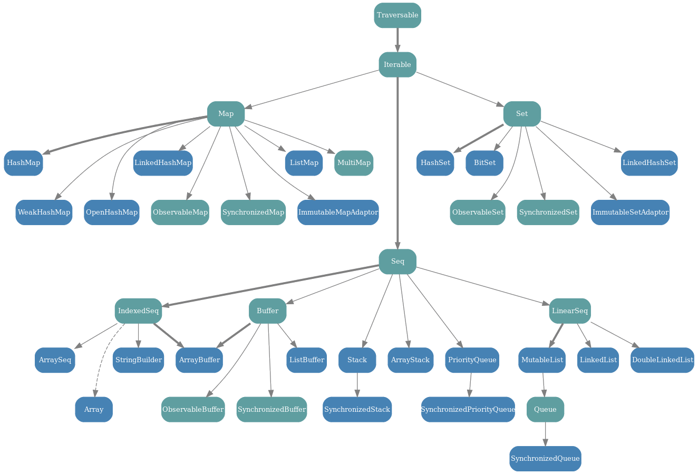

## Scala pro začátečníky
Michal Šenkýř - Sklik vývojář


## Scala
- Čistě object-oriented
  - Vše je objekt (vč. traits a primitivních typů)
- Plně funkcionální
  - Vše je výraz (vč. `if`, `for`, ...)
- Úspěšně používána v produkci
  - Twitter, Netflix, Tumblr, LinkedIn, Foursquare, ...

Poznámka:
trait je Scala ekvivalent interface


## Scala & Java
- Běží na Java Virtual Machine
  - Zaběhnutá stabilní platforma
- "Rozumí" si s Javou
  - Bytecode stejný
  - Třídy kompatibilní – Scala třídy ve speciální knihovně
  - Podpora psaní kódu Java způsobem (anotace pro getX/setX, konvertory pro kolekce, atd.)


## Scala vs Java
Java

```java
public class Person implements Serializable {
    private final String firstName;
    private final String lastName;

    public Person(String firstName, String lastName) {
        this.firstName = firstName;
        this.lastName = lastName;
    }

    public String getFirstName() { return firstName; }

    public String getLastName() { return lastName; }

    public Person withFirstName(String firstName) {
        return new Person(firstName, lastName);
    }

    public Person withLastName(String lastName) {
        return new Person(firstName, lastName);
    }

    public boolean equals(Object o) {
        if (o == this) return true;
        if (!(o instanceof Person)) return false;
        Person p = (Person) o;
        return Objects.equals(firstName, o.firstName) &&
            Objects.equals(lastName, o.lastName);
    }

    public int hashCode() {
        Objects.hash(firstName, lastName);
    }

    public String toString() {
        return "Person(" + firstName + "," + lastName + ")";
    }
}
```

Scala

```scala
case class Person(firstName: String, lastName: String)
```


## Scala vs Java
Java

```java
List<String> keywords = Arrays.asList("Apple", "Ananas", "Mango", "Banana", "Beer");
Map<Character, List<String>> result = new HashMap<>();
for (String k : keywords) {
    char firstChar = k.charAt(0);
    if (!result.containsKey(firstChar)) {
        result.put(firstChar, new ArrayList<>());
    }
    result.get(firstChar).add(k);
}
for (List<String> list : result.values()) {
    Collections.sort(list);
}
System.out.println(result);
```

Scala

```scala
val keywords = List("Apple", "Ananas", "Mango", "Banana", "Beer")
val result = keywords.sorted.groupBy(_.head)
println(result)
```

Poznámka:
Mapa seznamů slov podle prvních písmen s lexikografickým řazením


## Scala vs Java
- Podpora funkcionálního programování
  - Od r. 2004 (Java 8 až o 10 let později)
  - Plná podpora closures
- Propracovanější Collections
- Pattern matching
- Inference konce výrazu (žádné středníky!)
- Silný důraz na používání immutable tříd


## Scala vs Java
- Vyšší informační hustota
  - Odstranění zbytečné syntaxe, inference typů, string interpolace, ...
  - Vlastní operátory
- Čitelnost kódu
- Dobrá udržovatelnost kódu
  - Převod runtime chyb na compile-time
  - Silná závislost na typových parametrech, nahrazení null hodnot třídou Option, používání immutable tříd

Poznámka:
Plná podpora closures = lze měnit vnější proměnné


## Scala way vs Java way
- Minimalizace kódu a čitelnost
  - Oproti slepému používání design patternů
- Nepoužívat kanón na vrabce
  - Snazší refaktorovat
- Scala nedrží vývojáře za ručičku
  - Poskytuje nástroje – správná volba na programátorovi
- Immutable třídy
  - Funkcionální programování, paralelizace, testování
- Maximální type safety
  - Minimalizace přetypovávání (TypeTags proti erasure)

Poznámka:
Nedrží za ručičku = poskytuje velké množství různých cest, jak dosáhnout daného cíle

Type Tags – Scala umí automaticky resolvit třídy v typových parametrech, pokud je to na patřičných místech aktivováno


## Hierarchie tříd
 <!-- .element: style="border: none; background: none; box-shadow: none" -->


## SBT – Simple Build Tool
- http://scala-sbt.org
- Implicitní podpora Javy a Scaly
- Automaticky stáhne Scala kompilátor a knihovny
- Používá Scala kompilátor
- Snadno rozšiřitelné
- Maven repozitáře přes Ivy


## Příprava
- Vytvoření projektu

  ```bash
  mkdir -p projekt/src/main/scala && cd projekt
  ```

- build.sbt

  ```scala
  name := "Projekt"
  
  scalaVersion := "2.12.0"
  ```

- Příkazy
  - `sbt console` - REPL
  - `sbt compile` – kompilace
  - `sbt run` – kompilace a spuštění
  - `sbt ~run` – průběžná kompilace a spouštění

Poznámka:
JRE >= 1.6

SBT:

```bash
curl -L -o sbt https://raw.githubusercontent.com/paulp/sbt-extras/master/sbt && chmod +x sbt
```

Ammonite REPL:

```bash
curl -L -o amm https://git.io/vP4Gw && chmod +x amm
```

Další SBT direktivy:
- organization = groupId
- version = verze projektu
- description = popis
- libraryDependencies = závislosti
- publishMavenStyle = vygenerovat POM


## Immutable proměnné

```scala
val x: Int = 5
```

- Typová inference
- Jako `final` v Javě
- Paralelizace
- Čitelnost kódu
- Lazy evaluation

  ```scala
  lazy val x: Int = 5
  ```

Poznámka:
Java JIT kompilátor umí odvodit podle použití v kódu, zda lze optimalizovat jako final


## Mutable proměnné

```scala
var x: Int = 5
```

- Pro výkonostně kritický kód
- Obtížnější úvaha o obsažené hodnotě
- Použití pouze když “víte, co děláte”


## Definice tříd

```scala
class Test
```

- Více tříd v jednom souboru
  - Název souboru libovolný
  - Přehlednější souborová struktura
- Modifikátory
  - Jako v Javě, ale default je public a konkrétní package private

    ```scala
    private[sql]
    ```

Poznámka:
Více tříd – např. Service a Exception


## Vestavěné singletony

```scala
object Test
```

- Jako Java třída se static membery
  - Scala třídy nemají static membery – přesun do tzv. companion objektů (`object` se stejným názvem)
- Simulace package hierarchie


## Primární konstruktor

```scala
class Test(param: Int,
           val get: Int,
           var getSet: Int,
           private val privateGet: Int) {
  ...
}
```

- V těle třídy, parametry v signatuře třídy
- Parametrům se vytvoří gettery/settery, pokud jsou `val`/`var`
- Default hodnoty
- Proměnným se vytváří gettery/settery
  - Obcházeni použitím bloku


## Doplňkové konstruktory

```scala
def this(param: String) = this(param.toInt)
```

- `this` metody bez návratového typu
- Začínají voláním jiného konstruktoru
  - Řetěz končí voláním primárního konstruktoru


## Metody

```scala
def transform(param1: Int, param2: Int = 2): Int = param1 * param2
```

- Vynechání návratového typu - typová inference
- Default hodnoty parametrů
  - Parametry volání názvem místo pořadím

    ```scala
    transform(param1 = 1)
    ```

- Bez parametrů lze vynechat závorky
  - Závorky značí side-effecty
- Předávání parametru jménem (lazy vyhodnocování)

  ```scala
  def tranform(param: => Int): Int = ...
  ```

Poznámka:
Metody bez parametrů se tváří jako fieldy
Závorky u side-effectů se používají, aby se metoda nepletla s fieldem
Zmínit rozdíly ve volání metod bez parametrů bez/s závorkami (závorky lze vynechat, ale ne přidat)


## Metody
- Varargs

  ```scala
  def transform(params: Int*): Int = ...
  ```

  - Uvnitř metody typ `Seq[T]`
  - Rozvinutí `Seq[T]` na varargs explicitně

    ```scala
    transform(paramsSeq: _*)
    ```

- Metody a funkce nejsou totéž
  - Konverze metody na funkci

    ```scala
    val function = method _
    ```


## Symbolické metody (operátory)
- Volání v infix/postfix stylu

  ```scala
  class Test(val x: Int) {
    def +(other: Test) = new Test(x + other.x)
    def ! = new Test(-x)
  }
  new Test(1) + new Test(2) // == new Test(3)
  new Test(1) !             // == new Test(-1)
  ```

  - Metoda končí dvojtečkou - infix obráceně
  - Infix operátory (+, -, *, /, atd.) mají typickou precedenci


## Typové parametry

```scala
List[String]
```

- Interně Java generika (erasure)
- Kompilátor má přehled a vynucuje si dodržování
  - Vynechávání/přetypovávání se silně nedoporučuje
- TypeTags pro předání za runtime

Poznámka:
Postfix hlásí warning, pokud se nenaimportuje language.postfixOps


## Speciální metody
- `equals`
  - Volá se při použití `==`
- `apply`
  - Přímé “volání” objektu/instance (interoperace OOP - FP)
  - Přehlednost u `FunctionN`, `TupleN`, atd.
- `update`
  - Jako `apply`, ale s přiřazením


## Speciální metody
- `..._=`
  - Jako settery - přiřazení do fieldu
  - Getter musí existovat
- `unary_+`, `unary_-`, `unary_!`, `unary_~`
  - Unární operace


## Speciální metody
- `unapply`
  - Vrací `Option[T]`
  - Extraktor v pattern matchingu (inverz k `apply`)
    - Více parametrů - `T` je `TupleN`
  - Použití při přiřazování

    ```scala
    val Person(name, email) = person
    ```

- `unapplySeq`
  - Vrací `Option[Seq[T]]`
  - `unapply` pro proměnlivý počet hodnot
  - Např. regex pattern matching

Poznámka:
Ukázat vnořený unapply (s tuples)


## Case třídy
- Syntactic sugar pro value třídy
- Parametry tvoří immutable fieldy
- `copy` s default hodnotami - kopie se změnou
- `equals`, `hashCode` a `toString`
- Extendují `Product`
  - Přístup k parametrům podle pořadí
- Companion objekt
  - `apply` - vynechání `new`
  - `unapply` - extraktor parametrů


## Tuples

```scala
val tuple: (Int, Int) = (1, 2)
```

- Alternativa:

  ```scala
  val tuple: (Int, Int) = 1 -> 2
  ```

- Typy `Tuple1[T1]`, `Tuple2[T1, T2]`, ...
- Typově bezpečné N-tice (`TupleN`)
- `apply`, `unapply`, `_N`, `hashCode`, `equals`, `swap`, atd.


## Funkce

```scala
val function: Int => String = (x: Int) => x.toString
```

- Typy `Function0[+R]`, `Function1[-T1, +R]`, ...
- Parametry lze nechat odvodit typovou inferencí

  ```scala
  val function: Int => String = x => x.toString
  ```

- Funkce s N parametry (`FunctionN`)
- `apply`, `curried`, `tupled`


## Parciální funkce

```scala
val f = new PartialFunction[Int, Double] {
  override def apply(x: Int) = 1 / x
  override def isDefinedAt(x: Int) = x != 0
}
```

- Typ `PartialFunction[-A, +B]`
- Funkce s jedním parametrem s omezeným definičním oborem
- Snadnější definice [pattern matchingem](#pattern-matching)
- `isDefinedAt`, `orElse`, `andThen`, `lift`, `applyOrElse`, atd.

Poznámka:
Ukázat příklad definice funkce, kde parametry nejsou odvoditelné typovou inferencí:
val function = x => x.toString


## Importing
- Třídy/objekty
  - Wildcard je podtržítko
  - Statické importy rozeznány automaticky

    ```scala
    import scala.collection.JavaConverters._
    ```

- Více tříd/objektů najednou

  ```scala
  import scala.io.{Codec, Source}
  ```

- Objekt jako package


## Importing
- Řetězení

  ```scala
  import scala.collection
  import collection.Map
  ```

- Přejmenování

  ```scala
  import java.util.{List => JavaList}
  ```

- Vynechání

  ```scala
  import java.util.{Map => _, _}
  ```

- Lze lokálně v bloku
  - Např. membery z companion objektu


## Pattern matching <!-- .slide: id="pattern-matching" -->

```scala
x match {
  case ... =>
    ...
}
```

- Za `=>` je blok
- Kompilátor kontroluje vyčerpávající seznam
- Konkrétní hodnota

  ```scala
  case "value" =>
  ```

- Default case

  ```scala
  case _ =>
  ```


## Pattern matching
- Porovnání s proměnnou definovanou v kontextu

  ```scala
  case `variable` =>
  ```

- Typ

  ```scala
  case str: String =>
  ```

- Podmínka

  ```scala
  case person if person.name.startsWith("Jan") =>
  ```


## Pattern matching
- Extraktory (přes `unapply`/`unapplySeq`)

  ```scala
  case Person(name, email) =>
  ```

- Vnořování

  ```scala
  case Person(name, Address(city, street)) =>
  ```

- Selektivní extrakce

  ```scala
  case Person(_, Address(city, _)) =>
  ```

- Binding

  ```scala
  case person@Person(name, _) =>
  ```


## Pattern matching
- Výjimky

  ```scala
  val input = try System.console.readLine() catch {
    case _: IOError =>
      println("Nelze číst ze vstupu")
      "Default"
  } finally println("Konec vstupu")
  ```

- Parciální funkce

  ```scala
  val partFunc: PartialFunction[Any, Unit] = {
    case s: String => println(s)
  }
  ```


## Úvod do kolekcí
- Velmi silný framework pomocí funkcí vyššího řádu
- Transformace kolekcí místo prvků
- Připomíná Java Streams API, ale obsáhlejší (a prověřenější)
- Výkon a čitelnost
- Obecnost – metody co nejvýše v hierarchii
  - `String` i `Array` v hierarchii (stejné operace)

Poznámka:
Prověřenější = od roku 2010 (Java Stream od 2014)


## Úvod do kolekcí
- Immutable a mutable (immutable preferované)
- Obecné nadtřídy/traits – kód přijímá immutable i mutable a neprovádí změny
- Import balíku `scala.collection.mutable` pro explicitnost

  ```scala
  val set = new mutable.HashSet[Int, String]
  ```

- Nejužívanější mají alias ve `scala._` - není potřeba import


#### [Immutable kolekce](http://docs.scala-lang.org/overviews/collections/overview.html)

 <!-- .element: style="border: none; background: none; box-shadow: none; max-width: 80%" -->

Poznámka:
Option není kolekce, ale lze k němu tak přistupovat


#### [Mutable kolekce](http://docs.scala-lang.org/overviews/collections/overview.html)

 <!-- .element: style="border: none; background: none; box-shadow: none; max-width: 95%" -->


## Konstrukce kolekcí
- `apply`

  ```scala
  List("a", "b")
  Array("a", "b")
  Set("a", "b")
  TreeMap("a" -> 1, "b" -> 2)
  mutable.HashSet("a", "b")
  ```

- `empty`

  ```scala
  List.empty
  Set.empty
  Array.empty
  ```

  - Typy inferovány, ale lze i explicitně


## Konstrukce kolekcí
- Další konstrukční metody na companion objektech

  ```scala
  // Celá čísla dělitelná třemi do sta
  Array.range(0, 100, 3)
  // Malá násobilka
  Array.tabulate(10, 10) { (x, y) => (x + 1) * (y + 1) }
  // Prvních deset mocnin Eulerova čísla
  Array.iterate(1.0, 10)(_ * Math.E)
  // Obsahy kruhů o poloměrech 1 až 10
  Array.tabulate(10)(Math.PI * Math.pow(_, 2))
  ```

- Uniformní rovnost
  - Rozlišuje množiny, mapy a sekvence
  - Nerozlišuje mutable/immutable


## Základní operace
Operace                                    | Popis
-------------------------------------------|----------------------------
`xs(i)`                                    | Prvek na i-té pozici
`xs.size`                                  | Počet prvků
`xs.isEmpty`, `xs.nonEmpty`                | Prázdnost
`xs.indexOf(x)`                            | Index prvku
`xs.hasDefiniteSize`                       | Velikostní omezenost
`xs.head`, `xs.last`                       | První/poslední


Operace                                    | Popis
-------------------------------------------|----------------------------
`xs.headOption`, `xs.lastOption`           | První/poslední v `Option[T]`
`xs.tail`, `xs.init`                       | Bez prvního/posledního
`xs.find(p)`                               | První prvek podle predikátu
`xs.forall(p)`                             | Predikát pro všechny
`xs.exists(p)`                             | Existence podle predikátu


Operace                                    | Popis
-------------------------------------------|----------------------------
`xs.sum`, `xs.product`                     | Sečte/vynásobí prvky
`xs.min`, `xs.max`                         | Minimum/maximum
`xs.mkString(start,sep,end)`               | `String` z prvků s prefixem, suffixem a separátorem
`xs.toArray`, `xs.toList`, `xs.toSeq`, ... | Konverze kolekce


Operace                                    | Popis
-------------------------------------------|----------------------------
`xs.toMap`                                 | Mapa z kolekce dvojic (`Tuple2`)
`xs.sameElements(ys)`                      | Test na stejné prvky
`xs.foreach(f)`                            | Aplikace funkce na prvky
`xs.transform(f)`                          | Transformace mutable kolekce funkcí
`ms.transform(f)`                          | Transformace hodnot v mutable mapě funkcí


## Transformační operace
Operace    | Popis
-----------|------------------------------------
`xs ++ ys` | Konkatenace
`xs -- ys` | Odstranění prvků
`xs + x`   | Přidání prvku
`xs - y`   | Odebrání prvku
`xs & ys`  | Průnik množin
`xs ⎮ ys`  | Sjednocení množin


Operace                | Popis
-----------------------|------------------------------------------------
`xs.take(n)`           | Prvních n prvků
`xs.drop(n)`           | Bez prvních n prvků
`xs.takeWhile(p)`      | Nejdelší prefix podle predikátu
`xs.dropWhile(p)`      | Bez nejdelšího prefixu podle predikátu
`xs.patch(i,ys,r)`     | Nahrazení podsekvence


Operace                | Popis
-----------------------|------------------------------------------------
`xs.filter(p)`         | Filtrování podle predikátu
`xs.map(f)`            | Transformace funkcí
`xs.flatMap(f)`        | Transformace funkcí a rozvinutí
`xs.collect(f)`        | Shromáždění prvků podle parciální funkce


Operace                | Popis
-----------------------|------------------------------------------------
`xs.zip(ys)`           | Sloučení na kolekci párů podle indexu
`xs.zipAll(ys,x,y)`    | Jako `zip` s doplněním kratší
`xs.zipWithIndex`      | `zip` s indexy


Operace                | Popis
-----------------------|------------------------------------------------
`xs.partition(p)`      | Rozdělení podle predikátu
`xs.groupBy(f)`        | Rozdělení podle diskriminátoru (do mapy)
`xs.sortBy(f)`         | Řazení podle diskriminátoru


## Další operace
Operace                                 | Popis
----------------------------------------|------------------------------
`(z /: xs)(op)`, `xs.foldLeft(z)(op)`   | Kolekce do hodnoty z iniciální pomocí operace
`(xs :\ z)(op)`, `xs.foldRight(z)(op)`  | Jako `foldLeft` zprava


Operace                                   | Popis
------------------------------------------|------------------------------
`xs.reduceLeft(op)`, `xs.reduceRight(op)` | Redukce zleva doprava pomocí operace
`xs.grouped(size)`                        | Rozdělení na úseky
`xs.sliding(size, step)`                  | Sliding window s daným krokem

Poznámka:
reduceLeft potřebuje neprázdnou kolekci
grouped a sliding vrací iterátor


## Složitosti kolekcí
immutable | head | tail | apply | update | prepend | append | insert
----------|------|------|-------|--------|---------|--------|-------
List      | C    | C    | L     | L      | C       | L      | -
Stream    | C    | C    | L     | L      | C       | L      | -
Vector    | eC   | eC   | eC    | eC     | eC      | eC     | -
Stack     | C    | C    | L     | L      | C       | L      | -
Queue     | aC   | aC   | L     | L      | L       | C      | -
Range     | C    | C    | C     | -      | -       | -      | -
String    | C    | L    | C     | L      | L       | L      | -


mutable       | head | tail | apply | update | prepend | append | insert
--------------|------|------|-------|--------|---------|--------|-------
ArrayBuffer   | C    | L    | C     | C      | L       | aC     | L
ListBuffer    | C    | L    | L     | L      | C       | C      | L
StringBuilder | C    | L    | C     | C      | L       | aC     | L
MutableList   | C    | L    | L     | L      | C       | C      | L
Queue         | C    | L    | L     | L      | C       | C      | L
ArraySeq      | C    | L    | C     | C      | -       | -      | -
Stack         | C    | L    | L     | L      | C       | L      | L
ArrayStack    | C    | L    | C     | C      | aC      | L      | L
Array         | C    | L    | C     | C      | -       | -      | -


immutable       | lookup | add | remove | min
----------------|--------|-----|--------|-----
HashSet/HashMap | eC     | eC  | eC     | L
TreeSet/TreeMap | Log    | Log | Log    | Log
BitSet          | C      | L   | L      | eC
ListMap         | L      | L   | L      | L

---

mutable         | lookup | add | remove | min
----------------|--------|-----|--------|----
HashSet/HashMap | eC     | eC  | eC     | L
WeakHashMap     | eC     | eC  | eC     | L
BitSet          | C      | aC  | C      | eC


## Views
- Transformační operace vytváří novou kolekci (strict transformation)
- “Pohled” aplikující transformace při přístupu k prvku (lazy transformation)

  ```scala
  val view = coll.view.map(_ + 1)
  view(1) // aplikuje map jen na jeden prvek
  ```

  - Materializace

    ```scala
    val coll = view.force // aplikuje na všechny prvky
    ```


## Views
- Implementovány jen pro obecné kolekce
  - Ztrácejí informaci o kolekci (`force` může vrátit jinou)
- Selektivní update mutable kolekce

  ```scala
  val arr = (0 to 9).toArray
  arr.view.slice(3, 7).transform(-_)
  ```

- Mohou mást u operací se side-effecty a nevyplatí se pro malé kolekce
  - Doporučují se v čistě funkcionálním kódu bez side-effectů nebo pro mutaci kolekcí


## Stream
- Speciální kolekce s lazy transformacemi a pamatováním hodnot
- Operátor `#::`

  ```scala
  def toZero(n: Int): Stream[Int] =
    n match {
      case 0 => Stream(0)
      case n if n > 0 => n #:: toZero(n - 1)
      case n if n < 0 => n #:: toZero(n + 1)
    }
  ```

- Nekonečnost

  ```scala
  def fib(a: BigDecimal, b: BigDecimal): Stream[BigDecimal] =
    a #:: fib(b, a + b)
  ```


## For-comprehensions
- Syntactic sugar pro specifické použití `map`, `flatMap` a `filter`

  ```scala
  val x = (1 to 10).flatMap { i =>
    (1 to 10).filter(j => i != j).map { j =>
      i * j
    }
  }
  ```

- Silnější než `for`/`foreach`

  ```scala
  val x = for {
    i <- 1 to 10
    j <- 1 to 10 if i != j
  } yield i * j
  ```


## For-comprehensions
- Bez `yield` se volá `foreach` a nevrací hodnotu

  ```scala
  for { i <- 1 to 10 } println(i)
  ```

- Libovolné kolekce

  ```scala
  val cities = (for {
    person <- people if person.registered
    address <- person.addresses
  } yield address.city).distinct
  ```

- Typy kompatibilní s for-comprehensions = monadické (`map`, `flatMap`)


## Implicitní třídy
- Rozšířování o nové metody

  ```scala
  implicit class EnhancedString(str: String) {
    def prefix(prefix: String) = prefix + str
  }
  
  println("World".prefix("Hello "))
  ```

- Definovány v jiném traitu, třídě nebo objektu
    - Import pro externí použití
- Jeden parametr - rozšiřovaná třída/trait
- Název musí být unikátní v kontextu

Poznámka:
Extensions (extends AnyVal) = nevytváří nový objekt (optimalizace)


## Scala ekosystém
- SBT – univerzální build tool
- Lift – view-first webový framework s důrazem na bezpečnost
- ScalaTest – unit testing framework s mnoha styly syntaxe
- ScalaCheck – framework pro property-based testing
- Spark – framework pro komplexní práci s big data
- Kafka – robustní distribuovaný messaging systém
- Slick – funkcionální mapování relační databáze
- Spray – high-level DSL pro REST webové služby
- Macroid – framework pro vývoj Andoid aplikací
- a další…
    - viz např. [GitHub:lauris/awesome-scala](https://github.com/lauris/awesome-scala)


## Scala historie
- 1995 – Java 1.0
- 1996 – Martin Odersky a Phil Wadler - jazyk Pizza – generika, funkce vyšších řádů a pattern matching na Javě
- 1998-9 – Generic Java (kompilátor stardardem pro Java 1.3 v r. 2000, generika v Javě 5 v r. 2004)
- 2000-2 – Funnel – funkcionální sítě, join kalkulus - nepraktické
- 2004 – Scala 1.0 (něco mezi GJ a Funnelem) pro Javu a .NET
- 2006 – Scala 2.0 – kompilátor ve Scale
- 2009 – Twitter - změna z Ruby na Scalu


- 2010 – Scala 2.8 – Collections API
- 2011 – 5-letý výzkumný grant a založení Typesafe (Lightbend v r. 2016)
- 2012 – .NET podpora zrušena
- 2013 – Scala 2.10 – implicits, string interpolace, futures & promises, dynamické třídy, podpora JDK 1.6-1.7, actors, atd.
- 2014 – lambdy a Stream API v Javě 8
- 2015 – Scala.js – Scala kompilátor do JavaScriptu
- 2016 – Scala 2.12 – podpora Javy 8 – funkcionální interoperace, využití nových funkcí JVM


## Scala pro pokročilé
- Typové meze, variance, kvantifikace a pohledy
- Implicitní parametry, konverze a evidence
- Typové manifesty
- Polymorfismus ad-hoc, F-bounded a strukturální typy
- Dynamické třídy
- Paralelizace, paralelní kolekce a actor systém (Akka)
- String interpolátory
- Spark, Lift, Spray, ScalaTest, ScalaCheck, ...


## Děkuji za pozornost
Michal Šenkýř - Sklik vývojář


## Úloha – Vyhledávač duplicitních souborů
- Vyhledejte duplicitní soubory v daných lokacích
- Duplicitní = stejný hash (SHA-1)
- Optimalizace - nejdříve porovnáme velikost
- Výsledky - na každém řádku jedna množina duplicit


## Úloha 2 – N-ticové pexeso
- Pexeso, ale místo dvojic jsou n-tice
- Nastavení - šířka a výška hracího pole, délka hledaných n-tic
- Tah - hráč zadává n koordinátů a při každém zadání ukážeme hrací pole s odkrytými prvky
- Mezi tahy vyhodnotíme a odstraníme (stejné) nebo zakryjeme (odlišné) prvky
- Vítězství - pole je prázdné - zobrazíme počet tahů
