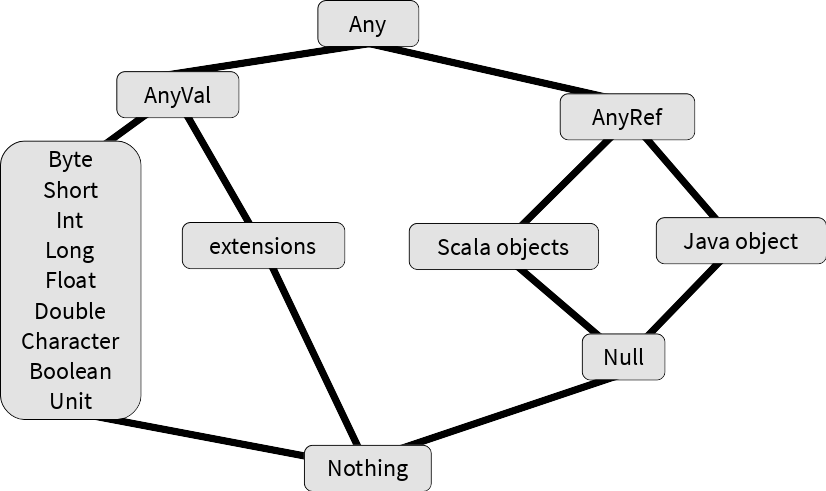

## Scala for beginners
Michal Šenkýř - Sklik developer


## Scala
- Purely object-oriented
  - Everything is an object (incl. traits and primitive types)
- Fully functional
  - Everything is an expression (incl. `if`, `for`, ...)
- Successfully used in production
  - Twitter, Netflix, Tumblr, LinkedIn, Foursquare, ...

Note:
trait is a Scala equivalent of an interface


## Scala & Java
- Runs on Java Virtual Machine
  - Established stable platform
- Inter-operates with Java
  - Bytecode is the same
  - Classes are compatible – Scala classes in a special library
  - Supports structuring code the Java way (annotations for getX/setX, converters for collections, etc.)


## Scala vs Java
Java

```java
public class Person implements Serializable {
    private final String firstName;
    private final String lastName;

    public Person(String firstName, String lastName) {
        this.firstName = firstName;
        this.lastName = lastName;
    }

    public String getFirstName() { return firstName; }

    public String getLastName() { return lastName; }

    public Person withFirstName(String firstName) {
        return new Person(firstName, lastName);
    }

    public Person withLastName(String lastName) {
        return new Person(firstName, lastName);
    }

    public boolean equals(Object o) {
        if (o == this) return true;
        if (!(o instanceof Person)) return false;
        Person p = (Person) o;
        return Objects.equals(firstName, o.firstName) &&
            Objects.equals(lastName, o.lastName);
    }

    public int hashCode() {
        Objects.hash(firstName, lastName);
    }

    public String toString() {
        return "Person(" + firstName + "," + lastName + ")";
    }
}
```

Scala

```scala
case class Person(firstName: String, lastName: String)
```


## Scala vs Java
Java

```java
List<String> keywords = Arrays.asList("Apple", "Ananas", "Mango", "Banana", "Beer");
Map<Character, List<String>> result = new HashMap<>();
for (String k : keywords) {
    char firstChar = k.charAt(0);
    if (!result.containsKey(firstChar)) {
        result.put(firstChar, new ArrayList<>());
    }
    result.get(firstChar).add(k);
}
for (List<String> list : result.values()) {
    Collections.sort(list);
}
System.out.println(result);
```

Scala

```scala
val keywords = List("Apple", "Ananas", "Mango", "Banana", "Beer")
val result = keywords.sorted.groupBy(_.head)
println(result)
```

Note:
Map of lists of words by first letters in lexicographic ordering


## Scala vs Java
- Functional programming support
  - Since 2004 (Java 8 as far as 10 years later)
  - Full support for closures
- Sophisticated Collections API
- Pattern matching
- End of statement inference (no semicolons!)
- Strong emphasis on immutable classes


## Scala vs Java
- Higher information density
  - Removal of useless syntax, type inference, string interpolation, ...
  - Custom operators
- Code readability
- Code maintainability
  - Transformation of runtime errors to compile-time
  - Strong dependence on type parameters, replacement of null value by Option class, usage of immutable classes

Note:
Full support of closures = ability to mutate external variables


## Scala way vs Java way
- Code conciseness and readability
  - Compared to blind usage of design patterns
- Avoiding over-engineering
  - Refactoring easier
- Scala doesn't hold the developer's hand
  - Provides tools – correct choice is developer's job
- Immutable classes
  - functional programming, concurrency, testability
- High type safety
  - Avoid type-casts (TypeTags against erasure)

Note:
Doesn't hold hands = provides lots of different ways to reach the goal

Type Tags – Scala can automatically pass classes in type parameters if defined correctly


## Class hierarchy
 <!-- .element: style="border: none; background: none; box-shadow: none" -->


## SBT – Simple Build Tool
- http://scala-sbt.org
- Implicit support of Javy and Scaly
- Automatically downloads Scala compiler a library
- Uses the Scala compiler
- Easily extensible
- Maven repositories using Ivy


## Preparation
- Project creation

  ```bash
  mkdir -p projekt/src/main/scala && cd projekt
  ```

- build.sbt

  ```scala
  name := "Project"
  
  scalaVersion := "2.12.0"
  ```

- Commands
  - `sbt console` - REPL
  - `sbt compile` – compilation
  - `sbt run` – compilation and execution
  - `sbt ~run` – continuous compilation and execution

Note:
JRE >= 1.6

SBT:

```bash
curl -L -o sbt https://raw.githubusercontent.com/paulp/sbt-extras/master/sbt && chmod +x sbt
```

Ammonite REPL:

```bash
curl -L -o amm https://git.io/vP4Gw && chmod +x amm
```

Other SBT directives:
- organization = groupId
- version = project version
- description
- libraryDependencies
- publishMavenStyle = generate POM


## Immutable variables

```scala
val x: Int = 5
```

- Type inference
- Same as `final` in Java
- Concurrency
- Code readability
- Lazy evaluation

  ```scala
  lazy val x: Int = 5
  ```

Note:
Java JIT compiler can deduce from usage in code whether to optimize as final


## Mutable variables

```scala
var x: Int = 5
```

- For performance-sensitive code
- More difficult to reason about value
- Use only if "you know what you are doing"


## Class definition

```scala
class Test
```

- Multiple classes in one file
  - File name is arbitrary
  - Clearer file structure
- Modifiers
  - Same as in Java, but the default is public and package private can be specific

    ```scala
    private[sql]
    ```

Note:
Multiple classes – eg. Services and Exceptions


## Built-in singletons

```scala
object Test
```

- Same as a Java class with only static members
  - Scala classes do not have static members – moved into so-called companion objects (`object` with the same name)
- Package hierarchy emulation


## Primary constructor

```scala
class Test(param: Int,
           val get: Int,
           var getSet: Int,
           private val privateGet: Int) {
  ...
}
```

- In class body, parameters in class signature
- Automatic generation of getters/setters for parameters, if defined as `val`/`var`
- Default values
- Automatic generation of getters/setters for variables in body
  - Circumvention by using blocks


## Auxiliary constructors

```scala
def this(param: String) = this(param.toInt)
```

- `this` methods without return type
- Begin with calling another constructor
  - Chain ends in primary constructor call


## Methods

```scala
def transform(param1: Int, param2: Int = 2): Int = param1 * param2
```

- Return type can be omitted - type inference
- Default values for parameters
  - Call parameter choice by name instead of order

    ```scala
    transform(param1 = 1)
    ```

- Parentheses can be omitted for parameterless
  - Parentheses mark side-effects
- Passing parameter by name (lazy evaluation)

  ```scala
  def tranform(param: => Int): Int = ...
  ```

Note:
Parameterless methods look like fields
Parentheses used in methods with side-effects to distinguish from fields
Mention differences in calling parameterless methods without/with parentheses (can omit parens, but not add)


## Methods
- Variable argument lists

  ```scala
  def transform(params: Int*): Int = ...
  ```

  - Acts as type `Seq[T]`
  - Unroll `Seq[T]` into varargs explicitly

    ```scala
    transform(paramsSeq: _*)
    ```

- Methods and functions are not the same thing
  - Converting method into function

    ```scala
    val function = method _
    ```


## Symbolic methods (operators)
- Calling infix/postfix style

  ```scala
  class Test(val x: Int) {
    def +(other: Test) = new Test(x + other.x)
    def ! = new Test(-x)
  }
  new Test(1) + new Test(2) // == new Test(3)
  new Test(1) !             // == new Test(-1)
  ```

  - Method ending in colon - infix reversed
  - Infix operators (+, -, *, /, etc.) have standard precedence


## Type parameters

```scala
List[String]
```

- Internally Java generics (erasure)
- Compiler knows about them and enforces them
  - Omitting/casting is strongly discouraged
- TypeTags for passing at runtime

Note:
Postfix reports warning if language.postfixOps is not imported (can cause confusion)


## Special methods
- `equals`
  - Called when `==` is used
- `apply`
  - Direct “call” of object/instance (OOP - FP inter-operation)
  - Readability of `FunctionN`, `TupleN`, etc.
- `update`
  - Same as `apply`, but with assignment


## Special methods
- `..._=`
  - Like setters - assignment into field
  - Getter must exist (as a method)
- `unary_+`, `unary_-`, `unary_!`, `unary_~`
  - Unary operations


## Special methods
- `unapply`
  - Returns `Option[T]`
  - Extractor in pattern matching (inverse of `apply`)
    - Multiple parameters - `T` is `TupleN`
  - Usage by assignment

    ```scala
    val Person(name, email) = person
    ```

- `unapplySeq`
  - Returns `Option[Seq[T]]`
  - `unapply` for variable number of values
  - eg. regex pattern matching

Note:
Show nested unapply (with tuples)


## Case classes
- Syntactic sugar for value classes
- Parameters form immutable fields
- `copy` with default values - copy with modification
- `equals`, `hashCode` a `toString`
- Extend `Product`
  - Access to parameters by index
- Companion object
  - `apply` - omitting `new`
  - `unapply` - parameters extractor


## Tuples

```scala
val tuple: (Int, Int) = (1, 2)
```

- Alternative:

  ```scala
  val tuple: (Int, Int) = 1 -> 2
  ```

- Types `Tuple1[T1]`, `Tuple2[T1, T2]`, ...
- Type-safe tuple of N elements (`TupleN`)
- `apply`, `unapply`, `_N`, `hashCode`, `equals`, `swap`, etc.


## Functions

```scala
val function: Int => String = (x: Int) => x.toString
```

- Types `Function0[+R]`, `Function1[-T1, +R]`, ...
- Parameters can be type-inferred

  ```scala
  val function: Int => String = x => x.toString
  ```

- Function with N parameters (`FunctionN`)
- `apply`, `curried`, `tupled`


## Partial functions

```scala
val f = new PartialFunction[Int, Double] {
  override def apply(x: Int) = 1 / x
  override def isDefinedAt(x: Int) = x != 0
}
```

- Type `PartialFunction[-A, +B]`
- Function with one parameter and limited domain
- Easier definition by using [pattern matching](#pattern-matching)
- `isDefinedAt`, `orElse`, `andThen`, `lift`, `applyOrElse`, etc.

Note:
Example of function definition where parameters cannot be type-inferred:
val function = x => x.toString


## Importing
- Classes/objects
  - Wildcard is underscore
  - Static imports discerned automatically

    ```scala
    import scala.collection.JavaConverters._
    ```

- Multiple classes/objects

  ```scala
  import scala.io.{Codec, Source}
  ```

- Object as package


## Importing
- Chaining

  ```scala
  import scala.collection
  import collection.Map
  ```

- Renaming

  ```scala
  import java.util.{List => JavaList}
  ```

- Removal

  ```scala
  import java.util.{Map => _, _}
  ```

- Can import locally in a block
  - e.g., members of companion object


## Pattern matching <!-- .slide: id="pattern-matching" -->

```scala
x match {
  case ... =>
    ...
}
```

- Code block after `=>`
- Compiler check exhaustiveness
- Specific value

  ```scala
  case "value" =>
  ```

- Default case

  ```scala
  case _ =>
  ```


## Pattern matching
- Comparison with value contained in scope variable

  ```scala
  case `variable` =>
  ```

- Type

  ```scala
  case str: String =>
  ```

- Condition

  ```scala
  case person if person.name.startsWith("John") =>
  ```


## Pattern matching
- Extractors (using `unapply`/`unapplySeq`)

  ```scala
  case Person(name, email) =>
  ```

- Nesting

  ```scala
  case Person(name, Address(city, street)) =>
  ```

- Selective extraction

  ```scala
  case Person(_, Address(city, _)) =>
  ```

- Binding

  ```scala
  case person@Person(name, _) =>
  ```


## Pattern matching
- Exceptions

  ```scala
  val input = try System.console.readLine() catch {
    case _: IOError =>
      println("Cannot read from input")
      "Default"
  } finally println("End of input")
  ```

- Partial functions

  ```scala
  val partFunc: PartialFunction[Any, Unit] = {
    case s: String => println(s)
  }
  ```


## Introduction to collections
- Powerful framework using higher-order functions
- Collection transformation instead of element iteration
- Resembles Java Streams API, but more comprehensive (and mature)
- Performance and readability
- Generality – methods defined as high as possible in the hierarchy
  - `String` and `Array` also in hierarchy (same operations)

Note:
Mature = since 2010 (Java Stream since 2014)


## Introduction to collections
- Immutable and mutable (immutable preferred)
- General superclasses/traits – code accepts both immutable and mutable and does not modify
- Import package `scala.collection.mutable` for explicitness

  ```scala
  val set = new mutable.HashSet[Int, String]
  ```

- Most used have an alias in `scala._` - import not needed


#### [Immutable collections](http://docs.scala-lang.org/overviews/collections/overview.html)

 <!-- .element: style="border: none; background: none; box-shadow: none; max-width: 80%" -->

Note:
Option is not a collection but can be used as one


#### [Mutable collections](http://docs.scala-lang.org/overviews/collections/overview.html)

 <!-- .element: style="border: none; background: none; box-shadow: none; max-width: 95%" -->


## Collections construction
- `apply`

  ```scala
  List("a", "b")
  Array("a", "b")
  Set("a", "b")
  TreeMap("a" -> 1, "b" -> 2)
  mutable.HashSet("a", "b")
  ```

- `empty`

  ```scala
  List.empty
  Set.empty
  Array.empty
  ```

  - Types inferred, but can be stated explicitly


## Collections construction
- Other construction methods on companion objects

  ```scala
  // Integers divisible by three up to one hundred
  Array.range(0, 100, 3)
  // Small multiplication table
  Array.tabulate(10, 10) { (x, y) => (x + 1) * (y + 1) }
  // First ten powers of Euler's number
  Array.iterate(1.0, 10)(_ * Math.E)
  // Areas of circles with radius of 1 to 10
  Array.tabulate(10)(Math.PI * Math.pow(_, 2))
  ```

- Uniform equation
  - Differentiates between sets, maps and sequences
  - Doesn't differentiate between mutable/immutable


## Basic operations
Operation                                  | Description
-------------------------------------------|----------------------------
`xs(i)`                                    | Element on the i-th position
`xs.size`                                  | Element count
`xs.isEmpty`, `xs.nonEmpty`                | Emptiness
`xs.indexOf(x)`                            | Element index
`xs.hasDefiniteSize`                       | Boundedness
`xs.head`, `xs.last`                       | First/last


Operation                                  | Description
-------------------------------------------|----------------------------
`xs.headOption`, `xs.lastOption`           | First/last in `Option[T]`
`xs.tail`, `xs.init`                       | Without first/last
`xs.find(p)`                               | First element by predicate
`xs.forall(p)`                             | Predicate for all elements
`xs.exists(p)`                             | Existence by predicate


Operation                                  | Description
-------------------------------------------|----------------------------
`xs.sum`, `xs.product`                     | Adds/multiplies elements
`xs.min`, `xs.max`                         | Minimum/maximum
`xs.mkString(start,sep,end)`               | `String` of element with prefix, suffix amd separator
`xs.toArray`, `xs.toList`, `xs.toSeq`, ... | Collection conversion


Operation                                  | Description
-------------------------------------------|----------------------------
`xs.toMap`                                 | Map from sequence of pairs (`Tuple2`)
`xs.sameElements(ys)`                      | Tests same elements
`xs.foreach(f)`                            | Applies function on elements
`xs.transform(f)`                          | Mutable collection transformation using function
`ms.transform(f)`                          | Transfors values of mutable map using function


## Transformation operations
Operation  | Description
-----------|------------------------------------
`xs ++ ys` | Concatenation
`xs -- ys` | Elements removal
`xs + x`   | Element addition
`xs - y`   | Element removal
`xs & ys`  | Set intersection
`xs ⎮ ys`  | Set union


Operation              | Description
-----------------------|------------------------------------------------
`xs.take(n)`           | First n elements
`xs.drop(n)`           | Without first n elements
`xs.takeWhile(p)`      | Longest prefix by predicate
`xs.dropWhile(p)`      | Without longest prefix by predicate
`xs.patch(i,ys,r)`     | Subsequence replacement


Operation              | Description
-----------------------|------------------------------------------------
`xs.filter(p)`         | Filtering by predicate
`xs.map(f)`            | Transformation by function
`xs.flatMap(f)`        | Transformation by function and flattening
`xs.collect(f)`        | Collection of elements by partial function


Operation              | Description
-----------------------|------------------------------------------------
`xs.zip(ys)`           | Merging to collection of pairs by index
`xs.zipAll(ys,x,y)`    | Same as `zip` with supplementation
`xs.zipWithIndex`      | `zip` with indices


Operation              | Description
-----------------------|------------------------------------------------
`xs.partition(p)`      | Division by predicate
`xs.groupBy(f)`        | Division by discriminator (into map)
`xs.sortBy(f)`         | Sorting by discriminator


## Other operations
Operation                               | Description
----------------------------------------|------------------------------
`(z /: xs)(op)`, `xs.foldLeft(z)(op)`   | Collection into value from initial using operation
`(xs :\ z)(op)`, `xs.foldRight(z)(op)`  | Same as `foldLeft`, but right to left 


Operation                                 | Description
------------------------------------------|------------------------------
`xs.reduceLeft(op)`, `xs.reduceRight(op)` | Reduction using operation
`xs.grouped(size)`                        | Division into fixed-size portions
`xs.sliding(size, step)`                  | Sliding window with the given step

Note:
reduceLeft needs a non-empty collection
grouped and sliding returns iterator


## Collection complexities
immutable | head | tail | apply | update | prepend | append | insert
----------|------|------|-------|--------|---------|--------|-------
List      | C    | C    | L     | L      | C       | L      | -
Stream    | C    | C    | L     | L      | C       | L      | -
Vector    | eC   | eC   | eC    | eC     | eC      | eC     | -
Stack     | C    | C    | L     | L      | C       | L      | -
Queue     | aC   | aC   | L     | L      | L       | C      | -
Range     | C    | C    | C     | -      | -       | -      | -
String    | C    | L    | C     | L      | L       | L      | -


mutable       | head | tail | apply | update | prepend | append | insert
--------------|------|------|-------|--------|---------|--------|-------
ArrayBuffer   | C    | L    | C     | C      | L       | aC     | L
ListBuffer    | C    | L    | L     | L      | C       | C      | L
StringBuilder | C    | L    | C     | C      | L       | aC     | L
MutableList   | C    | L    | L     | L      | C       | C      | L
Queue         | C    | L    | L     | L      | C       | C      | L
ArraySeq      | C    | L    | C     | C      | -       | -      | -
Stack         | C    | L    | L     | L      | C       | L      | L
ArrayStack    | C    | L    | C     | C      | aC      | L      | L
Array         | C    | L    | C     | C      | -       | -      | -


immutable       | lookup | add | remove | min
----------------|--------|-----|--------|-----
HashSet/HashMap | eC     | eC  | eC     | L
TreeSet/TreeMap | Log    | Log | Log    | Log
BitSet          | C      | L   | L      | eC
ListMap         | L      | L   | L      | L

---

mutable         | lookup | add | remove | min
----------------|--------|-----|--------|----
HashSet/HashMap | eC     | eC  | eC     | L
WeakHashMap     | eC     | eC  | eC     | L
BitSet          | C      | aC  | C      | eC


## Views
- Transformation operations create new collection (strict transformation)
- “View” applies transformations on element access (lazy transformation)

  ```scala
  val view = coll.view.map(_ + 1)
  view(1) // applies map on only one element
  ```

  - Materialization

    ```scala
    val coll = view.force // applies on all elements
    ```


## Views
- Implemented only on general collections
  - Collection type information lost (`force` can return a different collection)
- Selective update of mutable collection

  ```scala
  val arr = (0 to 9).toArray
  arr.view.slice(3, 7).transform(-_)
  ```

- Can be confusing with operations with side-effects and not benefitial for small collections 
  - Usage recommended only in purely functional code without side-effects or for selective collection mutation


## Stream
- Special collection with lazy transformations and value memoization
- `#::` operator

  ```scala
  def toZero(n: Int): Stream[Int] =
    n match {
      case 0 => Stream(0)
      case n if n > 0 => n #:: toZero(n - 1)
      case n if n < 0 => n #:: toZero(n + 1)
    }
  ```

- Infinite stream

  ```scala
  def fib(a: BigDecimal, b: BigDecimal): Stream[BigDecimal] =
    a #:: fib(b, a + b)
  ```


## For-comprehensions
- Syntactic sugar for specific usage of `map`, `flatMap` a `filter`

  ```scala
  val x = (1 to 10).flatMap { i =>
    (1 to 10).filter(j => i != j).map { j =>
      i * j
    }
  }
  ```

- Stronger than `for`/`foreach`

  ```scala
  val x = for {
    i <- 1 to 10
    j <- 1 to 10 if i != j
  } yield i * j
  ```


## For-comprehensions
- Without `yield` calls `foreach` and doesn't return value

  ```scala
  for { i <- 1 to 10 } println(i)
  ```

- Works on all collections

  ```scala
  val cities = (for {
    person <- people if person.registered
    address <- person.addresses
  } yield address.city).distinct
  ```

- Types compatible with for-comprehensions = monadic (`map`, `flatMap`)


## Implicit classes
- Extending existing classes with new methods

  ```scala
  implicit class EnhancedString(str: String) {
    def prefix(prefix: String) = prefix + str
  }
  
  println("World".prefix("Hello "))
  ```

- Defined in a different trait, class or object
    - Import for external usage
- One parameter - class/trait being extended
- Name must be unique in scope

Note:
Extensions (extends AnyVal) = don't create a new object (optimization)


## Scala ecosystem
- SBT – universal build tool
- Lift – view-first web framework with emphasis on security
- ScalaTest – unit testing framework with many syntax styles
- ScalaCheck – framework for property-based testing
- Spark – framework for complex processing of big data
- Kafka – robust distributed messaging system
- Slick – functional mapping of relation databases
- Spray – high-level DSL for REST web services
- Macroid – framework for Andoid aplication development
- and others…
    - see [GitHub:lauris/awesome-scala](https://github.com/lauris/awesome-scala)


## Scala history
- 1995 – Java 1.0
- 1996 – Martin Odersky a Phil Wadler - Pizza language – generics, higher-order functions and pattern matching on Java
- 1998-9 – Generic Java (compiler made standard for Java 1.3 in 2000, generics in Java 5 in 2004)
- 2000-2 – Funnel – functional nets, join calculus - impractical
- 2004 – Scala 1.0 (something between GJ and Funnel) on Java and .NET
- 2006 – Scala 2.0 – compiler in Scala
- 2009 – Twitter - migration from Ruby to Scala


- 2010 – Scala 2.8 – Collections API
- 2011 – 5-year research grant and founding of Typesafe (Lightbend in 2016)
- 2012 – .NET support dropped
- 2013 – Scala 2.10 – implicits, string interpolation, futures & promises, dynamic classes, JDK 1.6-1.7 support, actors, etc.
- 2014 – lambdas and Stream API in Java 8
- 2015 – Scala.js – Scala compiler to JavaScript
- 2016 – Scala 2.12 – Java 8 support – functional inter-operation, usage of new JVM features


## Advanced Scala
- Type bounds, variance, quantification and type classes
- Implicit parameters, conversions and evidences
- Type manifests
- Ad-hoc and F-bounded polymorphism and structural types
- Dynamic classes
- Concurrency, parallel collections and actor systems (Akka)
- String interpolators
- Spark, Lift, Spray, ScalaTest, ScalaCheck, ...


## Thank you for your attention
Michal Šenkýř - Sklik developer


## Exercise – Duplicate file finder
- Find duplicate files in given locations
- Duplicity = same hash (SHA-1)
- Optimization - first compare by size
- Results - one set of duplicates on every line


## Exercise 2 – Game of Tuples
- Like Pairs (Memory, Concentration, ...) but with arbitrary tuples
- Settings - width and height of playing field, tuple size
- Turn - player enters n coordinates and with every input the board is printed out with selected elements revealed
- Between turns we evaluate the selection and remove (same) or conceal (different) elements
- Victory - field is empty - print out number of turns
